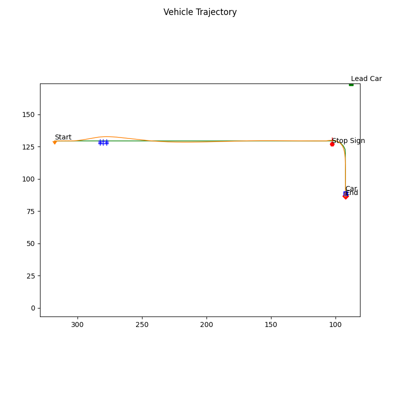

# Self-Driving Car Project 
[](https://github.com/yourusername/yourrepo)

## Overview

This project demonstrates autonomous driving capabilities using two different simulation environments. The **main branch** uses **ROS2** and **Gazebo** to simulate the vehicle's interactions in a dynamic environment, while the **carla_simulator branch** leverages **Python** and the **CARLA Simulator** to provide an alternative platform for testing and development.

The project encompasses various modules that work together to achieve autonomous behavior, including lane tracking, obstacle avoidance (both static and dynamic), and behavioral planning. It also integrates outputs from semantic segmentation neural networks to improve drivable space estimation, lane estimation, and 2D object detection filtering for precise obstacle distance measurement.

## Key Features

- **Autonomous Capabilities:**
  - **Lane Tracking:** Ensures the vehicle follows the road lanes accurately.
  - **Obstacle Avoidance:** Handles both static and dynamic obstacles.
  - **Behavioral Planning:** Implements a state machine to manage transitions between:
    - Lane following
    - Deceleration when approaching a stop sign
    - Stopping at a stop sign
    - Resuming lane following after the stop sign

- **Path Generation:**
  - Generates spiral paths to create a set of goal states.
  - Implements helper functions such as `get_goal_state_set()`, `thetaf()`, `optimize_spiral()`, and `sample_spiral()` for robust path planning.

- **Static Collision Checking:**
  - Uses circle-based collision checking to verify the safety of planned paths through the `collision_check()` function.

- **Path Selection:**
  - Evaluates an objective function over a generated set of paths to select the optimal path, factoring in path safety and alignment with the global centerline.

- **Velocity Profile Generation:**
  - Computes velocity profiles that handle various driving scenarios (e.g., stop signs, dynamic obstacles, and lane maintenance) using the `compute_velocity_profile()` function.

- **Semantic Segmentation Integration:**
  - Utilizes semantic segmentation outputs to:
    - Estimate drivable space in 3D.
    - Implement lane estimation.
    - Filter errors in 2D object detection to more accurately determine obstacle distances.

## Key Skills & Technologies

- **ROS2 & Gazebo:**  
  Used for real-time simulation and testing of autonomous driving functionalities in the main branch.

- **Python & CARLA Simulator:**  
  Employed in the carla_simulator branch to offer an alternative simulation environment using Python.

- **Algorithm Development:**  
  - State machine design for behavior planning.
  - Spiral path generation and optimization.
  - Collision checking and path selection algorithms.

- **Machine Learning Integration:**  
  - Applying semantic segmentation for drivable space and lane estimation.
  - Enhancing object detection accuracy via filtering techniques.

## Installation

### ROS2 and Gazebo (Main Branch)

1. **Install ROS2:**
   - Follow the official [ROS2 installation guide](https://docs.ros.org/en/rolling/Installation.html) for your operating system. For example, on Ubuntu:
     ```bash
     sudo apt update && sudo apt install ros-<ros2-distro>-desktop
     ```
     Replace `<ros2-distro>` with your ROS2 distribution (e.g., `foxy`, `galactic`, or `rolling`).

2. **Source ROS2 Setup:**
   ```bash
   source /opt/ros/<ros2-distro>/setup.bash
   ```
3. **Gazebo Setup:**
   ```bash
   sudo apt install gazebo11 libgazebo11-dev
   ```
## Launch and Run  ROS2 

```bash
colcon build
source install/setup.bash
ros2 launch autonomous_car_pkg world_gazebo.launch.py
```

## Launch and Run Carla 
1. Go to the Project Directory

```bash
CarlaUE4.exe /Game/Maps/Course4 -windowed -carla-server -benchmark -fps=30
```
2. In second terminal navigate to course4 final project and run this
```bash
python module_7.py
```
## Demo 
The Demo trajectory of the autonomous vehicle and demonstrating , obstacle avoidance , dynamic and static and also sign recogonization
  


The Video shows the demonstartion of the capabilities in carla simulator, **Please click on the image to watch the video**

[](https://youtu.be/vldQQFKg0iw?feature=shared)  


